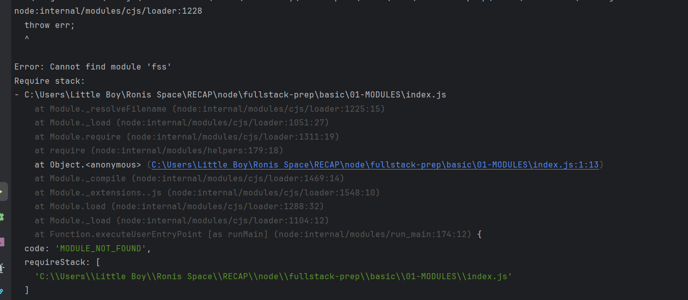
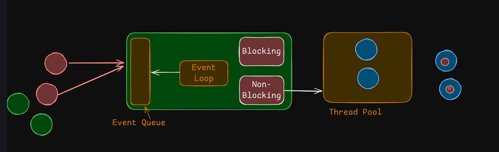

### What is node_js ?
### Node JS is a run time  env. to run  javascript in our local machine.
* We can build backend server using node_JS 

### Major different between Browser and Node_JS Env.
#### Browser (JS, Web Api - fetch, alert)
#### NOde js (JS, Extra, fs) it's not support web API. 

**_||  We can use set time out and in on both environments because creator of Node JS re-empliment some feature of browser apis._**



Modules are a collections  of code  that provides some functionality.

In node.js we have 3 modules:
1. Built  in modules
2. 3rd  party modules,downloaded by npm.
3. Own modules, Custom modules.

    // Today we goona learn FILE SYSTEM in node.JS using fs
    * fs basically an object, which provides some functions to interact file system in our system.
    * What is require function?
    =>  Require function is a parameter of a wrapper function developed by Node.js developer team. When we run some code in Node.js all the source code automatically wrapped  by wrapper function, that's why require function useful in node.js env. not in Browser.

    * Wrapper function. provides exports, require, modules, __filename, __dirname these parameters.
    ( function (exports, require, modules, __filename, __dirname) {
    // rest of source code.
    }
    })();

    How require function work?
    Whenever, we pass a string basically a module name in require function, initially it checks 3rd party module, if matched then load it, if not then check it on built in modules. not found then  it throw an error. check on readme.
    ./ we tell require check our custom modules.

    node_modules stores  all the third party modules.

    Package.json is a configuration file  that  records all the dependencies used in a project.
    Package-lock.json dependencies on dependencies

## Understanding blocking and non-blocking code.

sync means blocking,  async means non blocking, whenever we use sync code it block entire process util it finished work, then interpreter goes to next line to execute.
Async everything run in background, blocking code not interrupt  non-blocking code. when   it finished reading or execution it called a   function.

## Internal  Architecture of Node.js thread and event loop.

In Java script we have two things event queue and event loop. Event loop always check event queue and take req in FIFo and fulfill requirement.
Whenever, a blocking code comes in event loop means  sync event loop can be blocked, other users faced downtime. async event send it to thread pool, thread pool accepts req and give it to the cpu after finishing it execution it gives back to event-loop.If it is very less task then event handel it by own. We can't decide which task will be goes to thread pool or not.

Great question, Biswajit! The `fs` (File System) module in **Node.js** is one of the most **commonly used core modules**, and interviewers often ask about it, especially for **backend and full-stack roles**.



---------
```js
const fs = require("fs"); // CommonJS
// or
import * as fs from "fs"; // ES Module
```

---

## 🚀 Most Important `fs` Functions for Interviews

Here are the **top functions**, categorized with usage and interview tips:

---

### 1. **Reading Files**

#### a. `fs.readFile(path, options, callback)` – Async

```js
fs.readFile("example.txt", "utf-8", (err, data) => {
  if (err) throw err;
  console.log(data);
});
```

#### b. `fs.readFileSync(path, options)` – Sync

```js
const data = fs.readFileSync("example.txt", "utf-8");
console.log(data);
```

🧠 **Interview Tip:** Understand difference between sync and async — sync blocks the thread, async is non-blocking.

---

### 2. **Writing Files**

#### a. `fs.writeFile(path, data, options, callback)` – Async

```js
fs.writeFile("output.txt", "Hello World!", (err) => {
  if (err) throw err;
});
```

#### b. `fs.writeFileSync(path, data, options)` – Sync

```js
fs.writeFileSync("output.txt", "Hello World!");
```

🧠 **Interview Tip:** `writeFile` replaces content. For appending, use `appendFile`.

---

### 3. **Appending Data**

#### a. `fs.appendFile(path, data, options, callback)`

```js
fs.appendFile("log.txt", "New entry\n", (err) => {
  if (err) throw err;
});
```

#### b. `fs.appendFileSync(path, data, options)`

```js
fs.appendFileSync("log.txt", "Another line\n");
```

---

### 4. **Checking File or Directory Exists**

#### a. `fs.existsSync(path)`

```js
if (fs.existsSync("data.json")) {
  console.log("File exists");
}
```

🧠 **Note:** `fs.exists` (async) is deprecated — use `fs.promises.access()` instead.

---

### 5. **Creating Directories**

#### a. `fs.mkdir(path, options, callback)`

```js
fs.mkdir("newFolder", { recursive: true }, (err) => {
  if (err) throw err;
});
```

#### b. `fs.mkdirSync(path, options)`

```js
fs.mkdirSync("newFolder", { recursive: true });
```

---

### 6. **Deleting Files**

#### a. `fs.unlink(path, callback)`

```js
fs.unlink("old.txt", (err) => {
  if (err) throw err;
});
```

#### b. `fs.unlinkSync(path)`

```js
fs.unlinkSync("old.txt");
```

---

### 7. **Deleting Directories**

#### a. `fs.rmdir(path, callback)` (⚠️ deprecated in favor of `fs.rm`)

#### b. `fs.rm(path, options, callback)`

```js
fs.rm("newFolder", { recursive: true, force: true }, (err) => {
  if (err) throw err;
});
```

---

### 8. **Renaming Files or Folders**

#### a. `fs.rename(oldPath, newPath, callback)`

```js
fs.rename("oldName.txt", "newName.txt", (err) => {
  if (err) throw err;
});
```

#### b. `fs.renameSync(oldPath, newPath)`

```js
fs.renameSync("oldName.txt", "newName.txt");
```

---

### 9. **Reading Directory Contents**

#### a. `fs.readdir(path, callback)`

```js
fs.readdir("./", (err, files) => {
  if (err) throw err;
  console.log(files); // Array of file names
});
```

---

### 10. **Stat / File Info**

#### a. `fs.stat(path, callback)`

```js
fs.stat("example.txt", (err, stats) => {
  if (err) throw err;
  console.log(stats.size); // File size
  console.log(stats.isFile()); // true or false
});
```

---

### 11. **Using Promises with fs.promises**

You can use `fs.promises` for `async/await` style:

```js
import { promises as fsPromises } from "fs";

const readData = async () => {
  const data = await fsPromises.readFile("data.txt", "utf-8");
  console.log(data);
};
```

---

## 📌 Common Interview Questions

1. **Difference between `readFile` and `readFileSync`?**
2. **How to check if a file exists before reading it?**
3. **How to read all files from a folder?**
4. **What happens if `writeFile` is used on a non-existent file?**
5. **How to rename or move a file using `fs`?**
6. **What are `fs.promises` and why are they useful?**
7. **How to delete a directory recursively?**
8. **How to differentiate files vs directories in a folder?**

---


