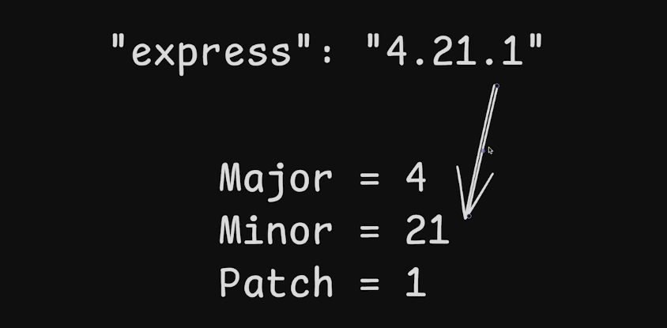

# Day 4 Express.js 

Express.js is a web framework for Node.js.

! by default express return 200 response  status code.

### How we give a semantic version to our app.

* If we fix a bug we increase the patch version.
* If we add a new feature we increase the minor version.
* If we make a breaking change we increase the major version.

``^ carrot simply means that the version should be greater than or equal to the version specified.
 ~ tilde simply means that the version should be greater than or equal to the version specified.
``

Restfull API stands for Representation state Transfer.

* We can't store the data in a server. Because when the server is scales this time, data can be loss.
* It Must be followed client-server architecture.
* Response must be cacheable.
* It must be stateless and not have.
  *Uniform Interface:
  This is a core principle, involving:
    * of Resources: Resources are identified by URIs.
    * Manipulation of Resources through Representations: Clients interact with resources by exchanging representations (e.g., JSON, XML) of those resources.
    * Self-Descriptive Messages: Each message exchanged between client and server should contain enough information to describe how to process the message.
    * Hypermedia as the Engine of Application State (HATEOAS): Resources should include links to related resources, guiding the client through the application's state transitions.