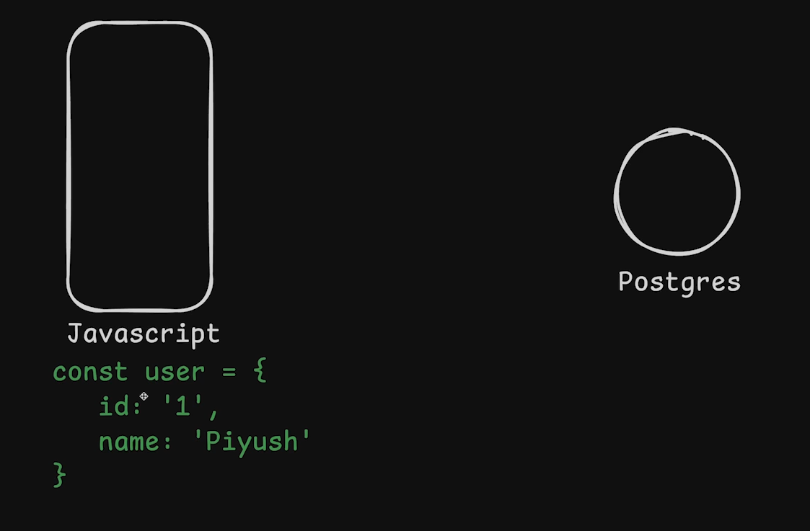
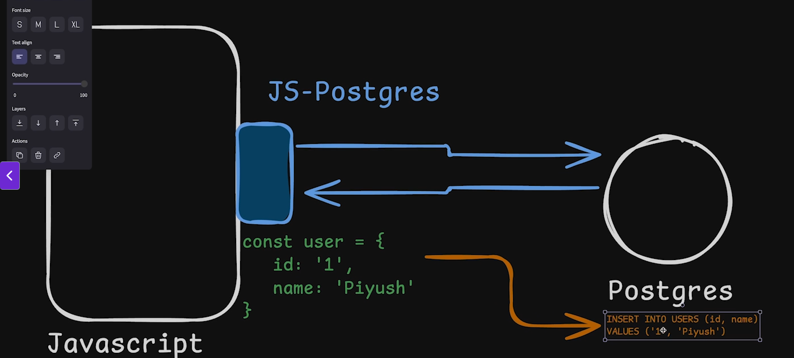

### What is Middleware in Express.js?
In Express.js, middleware refers to functions that have access to the request (req) and response (res) objects, as well as a next() function to pass control to the next middleware in the stack.

### What is .use()?
The method express.use() (or app.use()) is the main way to add middleware functions to your Express app. This method allows you to bind middleware to your entire application or to a specific route or group of routes.

* Middlewares are two types.
    * Global middlewares - (Top level).
    * Route Middleware - (any runs for a particular route).
----

### What is ORM?
Object Relational Mapping. It is a way to map the data in your database to the data in your application.

Example: A man can speck Hindi. Another person doesn't know Hindi. But they can understand the language using a translator. ORM works the same way.

Postgresql does not know what is a user object.

**Drizzle is an ORM. Used to connect to Postgresql and SQL.**

